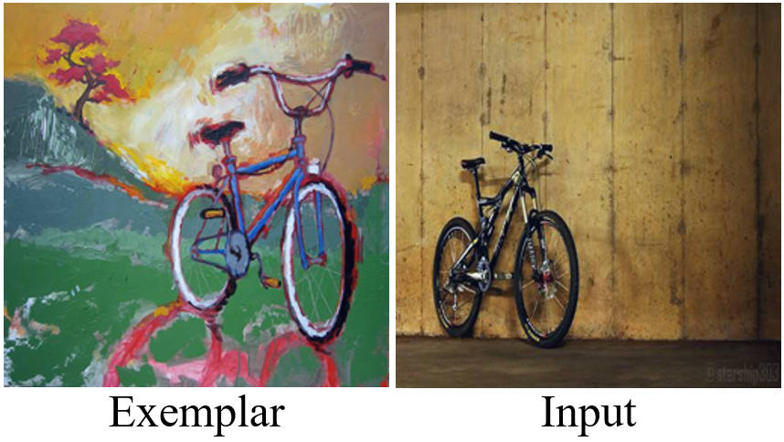

# LearningSA

### | [Paper](https://ieeexplore.ieee.org/document/10159138) | [Data](https://drive.google.com/file/d/14kQXoGDH0pcyKd_JZQVGZPumwDGCb_si/view?usp=drive_link)| 
<br/>

> LearningSA: Learning Semantic Alignment using Global Features and Multi-scale Confidence  
> Huaiyuan Xu, Jing Liao, Huaping Liu, and Yuxiang Sun*


## Introduction
Semantic alignment aims to establish pixel correspondences between images based on semantic consistency. It can serve as a fundamental component for various downstream computer vision tasks, such as style transfer and exemplar-based colorization, etc. Many existing methods use local features and their cosine similarities to infer semantic alignment. However, they struggle with significant intra-class variation of objects, such as appearance, size, etc. In other words, contents with the same semantics tend to be significantly different in vision. To address this issue, we propose a novel deep neural network of which the core lies in global feature enhancement and adaptive multi-scale inference. Specifically, two modules are proposed: an enhancement transformer for enhancing semantic features with global awareness; a probabilistic correlation module for adaptively fusing multi-scale information based on the learned confidence scores. We use the unified network architecture to achieve two types of semantic alignment, namely, cross-object semantic alignment and cross-domain semantic alignment. Experimental results demonstrate that our method achieves competitive performance on five standard cross-object semantic alignment benchmarks, and outperforms the state of the arts in cross-domain semantic alignment.

## Method 

Method Pipeline:

<p align='center'>

</p>


### Samples of the CroDom Dataset
Category: person


## Get Started

#### Installation and Data Preparation

step 1. Please prepare environment as that in [Docker](docker/Dockerfile).

step 2. Prepare LearningSA repo by.
```shell script
git clone https://github.com/lab-sun/LearningSA.git
cd LearningSA
```

step 3. Download data and arrange the folder as:
```shell script
LearningSA/
└── data
    ├── code 
    ├── crodom
    ├── PF_Pascal
    └── PF-dataset
    bbox_test_pairs_pf_pascal.csv
    bbox_test_pairs_pf.csv
    bbox_val_pairs_pf_pascal.csv
    train_pairs_pf_pascal.csv
```

#### Train model
```shell
python train.py
# if specify gpu:xx for training
python train.py --gpu xx
```

#### Test model
```shell
# PF-PASCAL
python image.py
# PF-WILLOW
python image_willow.py
```


#### Visualize the predicted result.

```shell
python image.py --vis
```

### Checkpoints
Download checkpoints and save them the folder weights:
| Config                                                                    | PCK(0.05)       |PCK(0.10)       | Model                                                                                         |
| ------------------------------------------------------------------------- | ---------- | ---------- | ---------------------------------------------------------------------------------------------- | 
| best_checkpoint_pascal                                | 81.4  | 93.4     | [gdrive](https://drive.google.com/file/d/1v3-rd5ooui8ZPFZUUV1wfhB2o-V1IORX/view?usp=drive_link) | 
| best_checkpoint_willow                  | 55.6   | 80.4  | [gdrive](https://drive.google.com/file/d/1a9Mee3cjjiRM4s3zcva_ZQggHJMqngI4/view?usp=drive_link) | 


### Applications

Style transfer, which transfers local styles from an exemplar image to regions of the input image with the same semantics:




Semantic alignment-based image morphing:

 


</center>


## Bibtex

If this work is helpful for your research, please consider citing the following BibTeX entries.

```
@ARTICLE{10159138,
  author={Xu, Huaiyuan and Liao, Jing and Liu, Huaping and Sun, Yuxiang},
  journal={IEEE Transactions on Circuits and Systems for Video Technology}, 
  title={Learning Semantic Alignment using Global Features and Multi-scale Confidence}, 
  year={2023},
  volume={},
  number={},
  pages={1-1},
  doi={10.1109/TCSVT.2023.3288370}}

```
