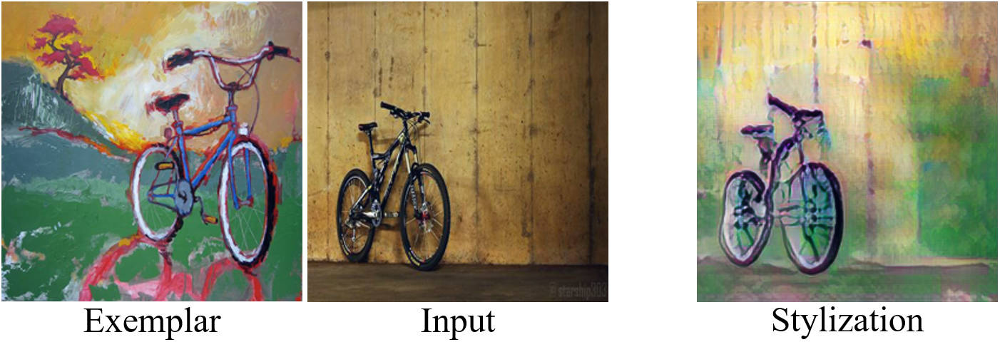
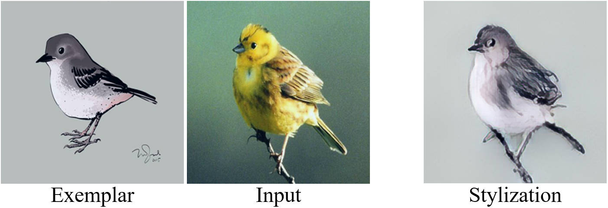

# LearningSA

The official implementation of LearningSA: Learning Semantic Alignment using Global Features and Multi-scale Confidence.

The code and dataset will be available upon acceptance of the paper.

### Samples of the CroDom Dataset

### Applications

Style transfer, which transfers the local style from the examplar image to the area with the same semantics in the input image:

 

Semantic alignment-based image morphing:

 

